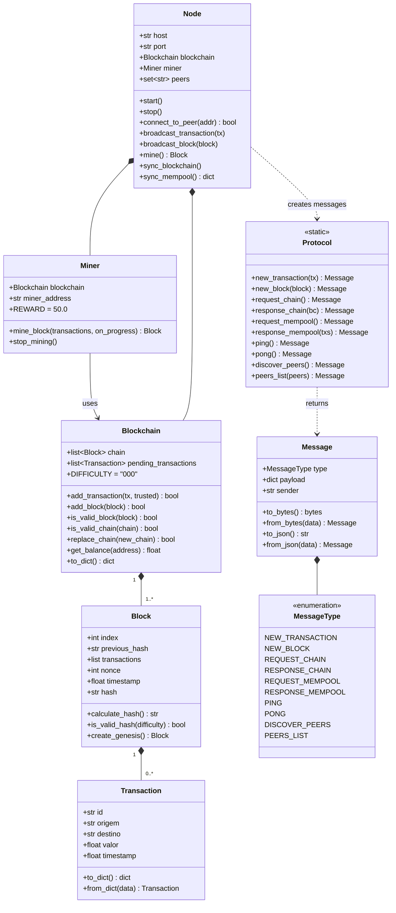
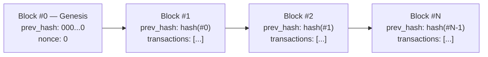
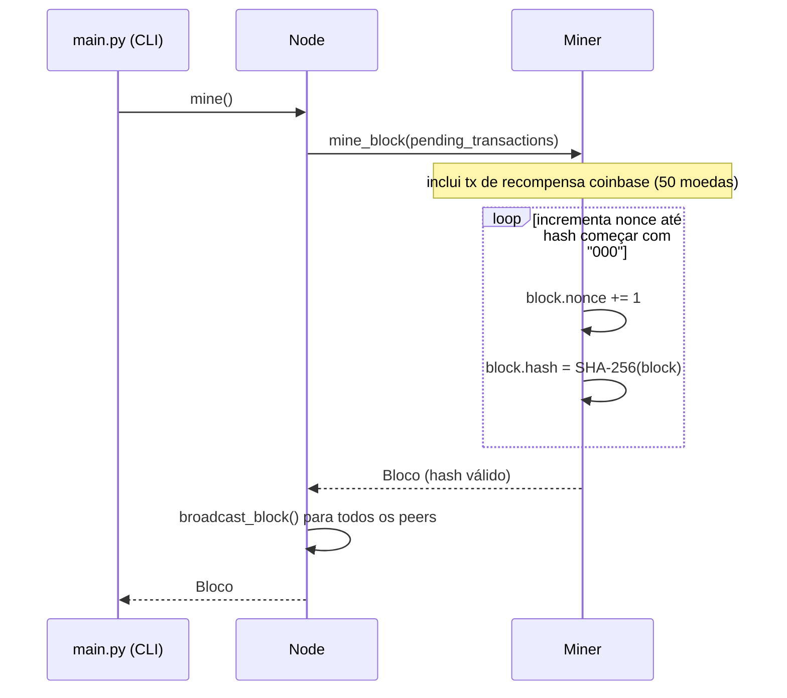
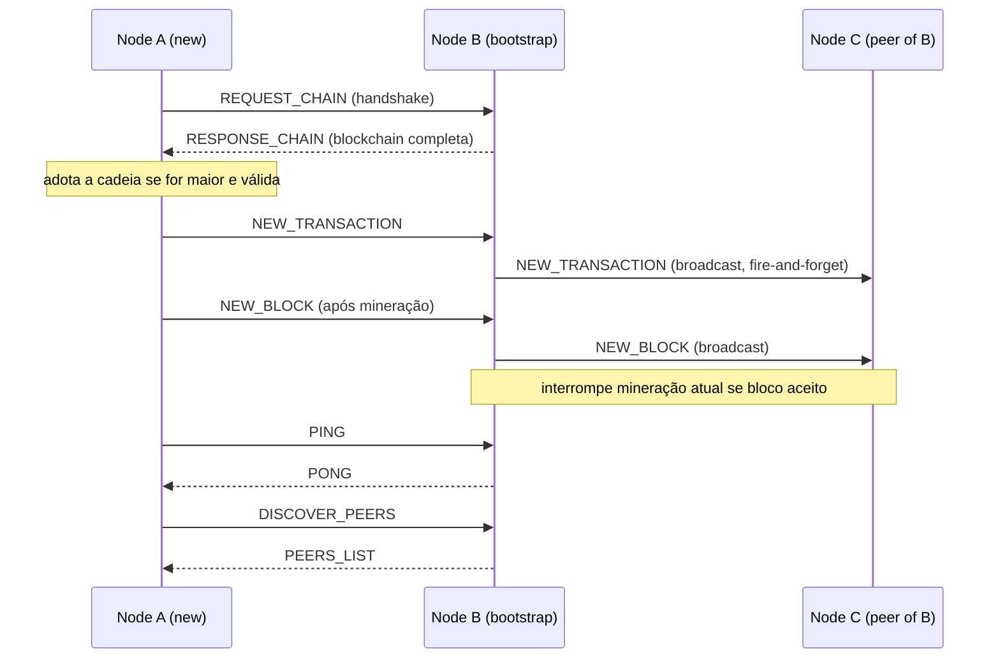
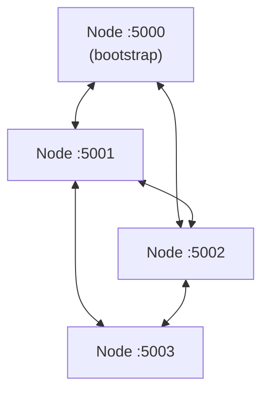

# labsd-atv03
Por Aimeê, Eduardo &amp; Keanu

---

## Arquitetura

O projeto implementa uma rede blockchain peer-to-peer utilizando apenas a biblioteca padrão do Python. Está organizado em três módulos:

| Arquivo | Responsabilidade |
|---|---|
| `core.py` | Modelos de dados, lógica da blockchain, mineração (PoW) e protocolo de mensagens |
| `node.py` | Rede TCP, gerenciamento de peers, roteamento de mensagens e sincronização |
| `main.py` | Ponto de entrada da CLI — analisa argumentos e gerencia o menu interativo |

### Diagrama de classes



### Estrutura de dados da blockchain

Cada bloco armazena um hash SHA-256 de seu próprio conteúdo e referencia o hash do bloco anterior, formando uma cadeia à prova de adulterações. A mineração exige encontrar um `nonce` tal que o hash resultante comece com `"000"` (Prova de Trabalho).



### Fluxo de mineração por Prova de Trabalho



### Fluxo de mensagens P2P

Toda a comunicação utiliza TCP com mensagens JSON prefixadas por tamanho (cabeçalho de 4 bytes big-endian).



### Topologia de rede

Os nós se comunicam em uma sobreposição estilo gossip. Cada nó rastreia um conjunto simples de endereços de peers conhecidos (`host:port`). Não há topologia estruturada — qualquer nó pode se conectar a qualquer outro.



---

## Como usar

### Requisitos

- Python **3.10+** (utiliza `match`/`case` e anotações de tipo union)
- Sem dependências externas — apenas a biblioteca padrão

### Iniciando um nó

```bash
# Primeiro nó (bootstrap)
python main.py --port 5000

# Nós adicionais entrando na rede
python main.py --port 5001 --bootstrap localhost:5000
python main.py --port 5002 --bootstrap localhost:5000 localhost:5001
```

Todas as opções de linha de comando:

| Flag | Padrão | Descrição |
|---|---|---|
| `--host` | `localhost` | Endereço de bind do servidor TCP |
| `--port` | `5555` | Porta de escuta |
| `--bootstrap` | *(nenhum)* | Lista de endereços de peers separados por espaço para conectar na inicialização |
| `--log` | `INFO` | Nível de log (`DEBUG`, `INFO`, `WARNING`, `ERROR`). Escrito em `node_<port>.log` |

### Menu interativo

Após iniciar um nó, um menu interativo é apresentado:

```
1. Criar transação        — send coins to another node's address (host:port)
2. Ver transações pendentes — list transactions waiting to be mined
3. Minerar bloco          — run PoW, earn 50 coins reward, broadcast the new block
4. Ver blockchain         — print all blocks and their transactions
5. Ver saldo              — check balance of own wallet or any address
6. Ver peers              — list currently known peers
7. Conectar a peer        — manually add a peer by address
8. Sincronizar            — pull the longest chain and missing mempool txs from peers
0. Sair                   — gracefully shut down the node
```

### Sessão de exemplo (dois nós)

**Terminal 1 — nó bootstrap**
```bash
python main.py --port 5000
# Escolha: 3   →  minera o bloco de recompensa genesis
```

**Terminal 2 — segundo nó**
```bash
python main.py --port 5001 --bootstrap localhost:5000
# Escolha: 1   →  cria uma transação
#   Destino: localhost:5000
#   Valor: 10
# Escolha: 8   →  sincroniza para confirmar que a transação apareceu no Nó 1
```

**Terminal 1 — minera a transação**
```bash
# Escolha: 3   →  minera um bloco contendo a transação recebida
```

### Endereços de carteira

O endereço de carteira de cada nó é sua string `host:port` (ex.: `localhost:5001`). Use-o como destino ao criar transações a partir de outro nó.

### Logs

Cada nó grava logs estruturados em `node_<port>.log` no diretório de trabalho. Use `--log DEBUG` para ver o progresso de mineração por nonce e rastreamentos completos de mensagens.
